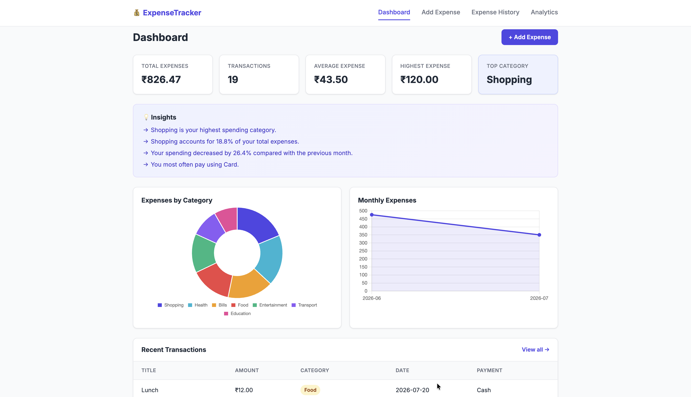
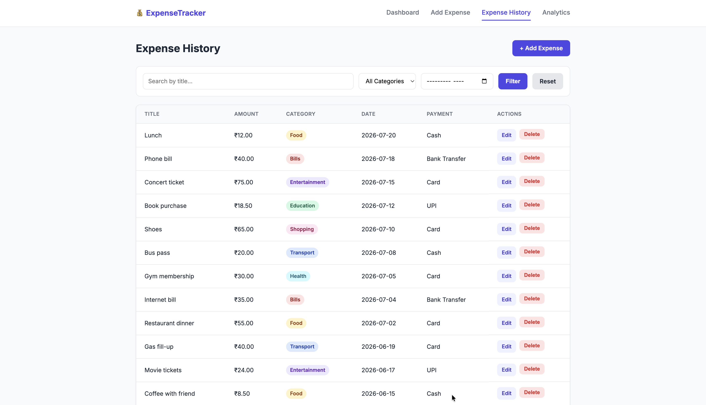
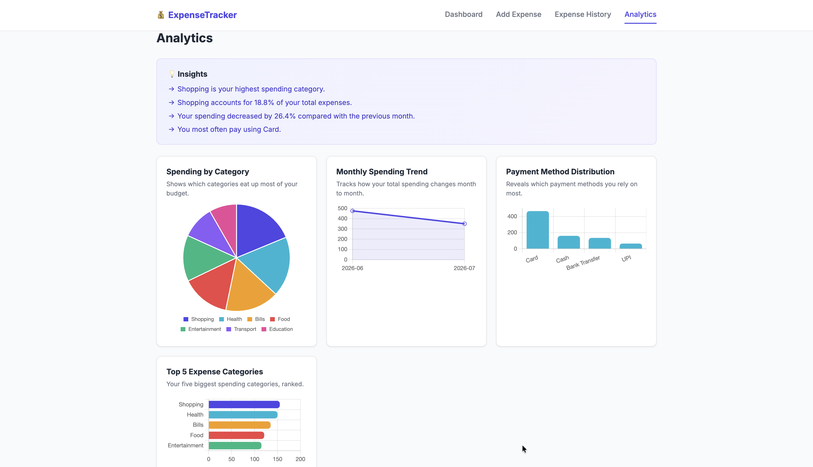

# 💰 Personal Expense Tracker

A full-stack web application for recording, managing, searching, and analyzing personal expenses.

Built using **Python, Flask, MySQL, HTML, CSS, JavaScript, Pandas, Matplotlib, and Chart.js**.

---

## 📸 Screenshots

### Dashboard



### Expense History



### Analytics



> Place your screenshots inside the `screenshots/` folder using these filenames:
> `dashboard.png`, `expenses.png`, and `analytics.png`.

---

## ✨ Features

- ➕ Add new expenses
- 👁️ View expense history
- ✏️ Edit existing expenses
- 🗑️ Delete expenses
- 🏷️ Categorize expenses
- 🔎 Search and filter expenses
- 📅 Filter expenses by month
- 📊 Dashboard with spending statistics
- 📈 Interactive charts using Chart.js
- 💡 Automatically generated spending insights
- 🐼 Data analysis using Pandas
- 📉 Standalone Matplotlib analysis reports
- 📱 Responsive desktop and mobile design

### Expense Categories

The application supports:

- Food
- Transport
- Shopping
- Bills
- Entertainment
- Education
- Health
- Other

---

## 📊 Dashboard

The dashboard provides an overview of your expenses, including:

- Total Expenses
- Number of Transactions
- Average Expense
- Highest Expense
- Top Spending Category
- Expenses by Category
- Monthly Spending Trend
- Recent Transactions

---

## 📈 Analytics

The analytics section provides visual insights into spending patterns.

### Visualizations

1. **Spending by Category**  
   Displays the proportion of total spending for each expense category.

2. **Monthly Spending Trend**  
   Shows how spending changes from month to month.

3. **Payment Method Distribution**  
   Displays spending based on payment methods such as Cash, Card, and UPI.

4. **Top 5 Expense Categories**  
   Ranks the categories with the highest total spending.

---

## 💡 Automatic Insights

The application uses **Pandas** to analyze expense data and generate insights based on the user's actual database records.

Examples include identifying:

- Highest spending categories
- Average spending
- Spending trends
- Major expense patterns

The insights are generated dynamically rather than being hardcoded.

---

## 🛠️ Tech Stack

| Layer                 | Technology              |
| --------------------- | ----------------------- |
| Frontend              | HTML5, CSS3, JavaScript |
| Charts                | Chart.js                |
| Backend               | Python, Flask           |
| Database              | MySQL                   |
| Database Connector    | MySQL Connector/Python  |
| Data Analysis         | Pandas                  |
| Data Visualization    | Matplotlib              |
| Environment Variables | python-dotenv           |

---

## 📁 Project Structure

````text
expense-tracker/
│
├── app.py
├── schema.sql
├── requirements.txt
├── .env.example
├── .gitignore
├── README.md
│
├── analysis/
│   └── expense_analysis.py
│
├── static/
│   ├── css/
│   │   └── style.css
│   │
│   └── js/
│       ├── script.js
│       ├── dashboard.js
│       └── analytics.js
│
├── templates/
│   ├── base.html
│   ├── index.html
│   ├── add_expense.html
│   ├── edit_expense.html
│   ├── expenses.html
│   └── analytics.html
│
└── screenshots/
    ├── dashboard.png
    ├── expenses.png
    └── analytics.png

# 🚀 Installation & Setup

## 1. Clone the Repository

```bash
git clone https://github.com/AntonyAbhishekA/Expense-Tracker.git
cd Expense-Tracker
2. Create a Virtual Environment

Creating a virtual environment keeps the project's Python dependencies isolated.

macOS / Linux
python3 -m venv .venv
source .venv/bin/activate
Windows
python -m venv .venv
.venv\Scripts\activate

After activation, the terminal should show:

(.venv)
3. Install Dependencies

Install all required Python packages:

pip install -r requirements.txt

The project uses:

Flask
MySQL Connector/Python
Pandas
Matplotlib
python-dotenv

🗄️ Database Setup

The application uses MySQL as its database.

1. Start MySQL

Make sure your local MySQL server is running.

2. Open MySQL Workbench

Connect to your local MySQL server.

3. Run schema.sql

Open the following file from the project:

schema.sql

Run the entire SQL script.

The script creates the:

expense_tracker

database and:

expenses

table.

It also inserts sample expense records so the dashboard contains data when the application is first started.

🔐 Environment Configuration

The actual .env file is not included in GitHub because it contains database credentials.

Create your local .env file using:

cp .env.example .env

Then open .env and enter your MySQL credentials:

DB_HOST=localhost
DB_USER=root
DB_PASSWORD=your_actual_mysql_password
DB_NAME=expense_tracker
DB_PORT=3306

If your local MySQL installation uses a Unix socket, configure the socket according to your MySQL setup.

Important

Never upload your real .env file to GitHub.

The project uses .gitignore to prevent sensitive and unnecessary files from being committed:

.env
.venv/
__pycache__/
*.pyc
.DS_Store

▶️ Running the Application

Open terminal
brew services start mysql
You should see something like:
Successfully started `mysql`
Then verify:
brew services list | grep mysql
You want MySQL to show:
started

Open VS Code

cd "/Users/antonyabhisheka/Documents/My Projects/expense-tracker"
pwd

Make sure your virtual environment is activated:

source .venv/bin/activate

Then start the Flask application:

python3 app.py

The application will start at:

http://127.0.0.1:5000

Open this address in your web browser.

📊 Running the Data Analysis Script

The project includes a standalone Pandas + Matplotlib analysis script.

Run:

python analysis/expense_analysis.py

The script analyzes the expense data and generates:

A text-based analysis report
Expense visualization charts
Category-based analysis
Monthly spending analysis

Generated charts are stored in:

analysis/charts/

🧠 How the Application Works

The overall application flow is:

User
  │
  ▼
Web Browser
  │
  ▼
Flask Application
  │
  ├── HTML Templates
  ├── CSS
  └── JavaScript
  │
  ▼
MySQL Database
  │
  ▼
Expense Data
  │
  ▼
Pandas Analysis
  │
  ├── Statistics
  ├── Insights
  └── Data Processing
  │
  ▼
Charts & Reports

Adding an Expense
When a user adds an expense:

User fills in the expense form
            ↓
Flask receives the form data
            ↓
Data is processed and validated
            ↓
SQL INSERT query
            ↓
Expense stored in MySQL
            ↓
Dashboard displays updated information

Viewing Expenses
MySQL Database
       ↓
SELECT query
       ↓
Flask
       ↓
HTML Template
       ↓
Expense History

Analytics
MySQL Database
       ↓
Expense Records
       ↓
Pandas DataFrame
       ↓
Data Processing
       ↓
Statistics & Insights
       ↓
Chart.js / Matplotlib
       ↓
Visual Reports

🗃️ Database Concepts
The project demonstrates fundamental SQL and database concepts.

Database
The application uses a MySQL database named:

expense_tracker
Table

The primary table is:
expenses
It stores individual expense records.

Primary Key
Each expense has a unique id:
id INT AUTO_INCREMENT PRIMARY KEY

MySQL automatically assigns a unique ID to each expense.
INSERT
Adds a new expense:

INSERT INTO expenses
(title, amount, category, date, payment_method, description)
VALUES
('Groceries', 45.50, 'Food', '2026-06-03', 'Card', 'Weekly shop');

SELECT
Retrieves expense records:
SELECT *
FROM expenses
ORDER BY date DESC;

UPDATE
Modifies an existing expense:
UPDATE expenses
SET title = 'Groceries',
    amount = 50.00
WHERE id = 3;

DELETE
Removes an expense:
DELETE FROM expenses
WHERE id = 3;

WHERE
The WHERE clause determines which records are affected.
For example:
DELETE FROM expenses
WHERE id = 3;
Without a WHERE condition, an UPDATE or DELETE statement could affect every record in the table.

📱 Responsive Design

The application is designed to work across different screen sizes:

Desktop
Laptop
Tablet
Mobile

The navigation and page layouts automatically adapt to smaller screens.

🧪 Sample Data

The schema.sql file contains sample expense records for testing the application.

The sample data uses dates from June–July 2026.

The sample records can be deleted and replaced with real expenses through the application.

🔒 Security Notes

The project follows basic security practices for local development:

Database credentials are stored in .env.
.env is excluded from Git tracking.
.env.example provides a safe configuration template.
The virtual environment is excluded from GitHub.
Python cache files are excluded from GitHub.
Sensitive credentials should never be committed to the repository.

Never commit passwords, API keys, or other secrets to GitHub.

📚 What This Project Demonstrates

This project demonstrates practical knowledge of:

Python programming
Flask web development
MySQL database integration
SQL CRUD operations
HTML5
CSS3
JavaScript
Chart.js
Pandas
Matplotlib
Environment variables
Python virtual environments
Git
GitHub
Responsive web design
Data visualization
Basic data analysis

📌 Future Improvements
Possible future enhancements include:

👤 User authentication
👥 Multiple user accounts
💰 Monthly budget management
🔔 Budget alerts
📄 Export expenses to CSV or PDF
🔄 Recurring expenses
📅 Advanced date-range filtering
☁️ Cloud database deployment
🌐 Online deployment of the Flask application
📊 More advanced financial analytics
📱 Progressive Web App support

👨‍💻 Author
Antony Abhishek A

Personal Expense Tracker built as a full-stack web development project.
````
